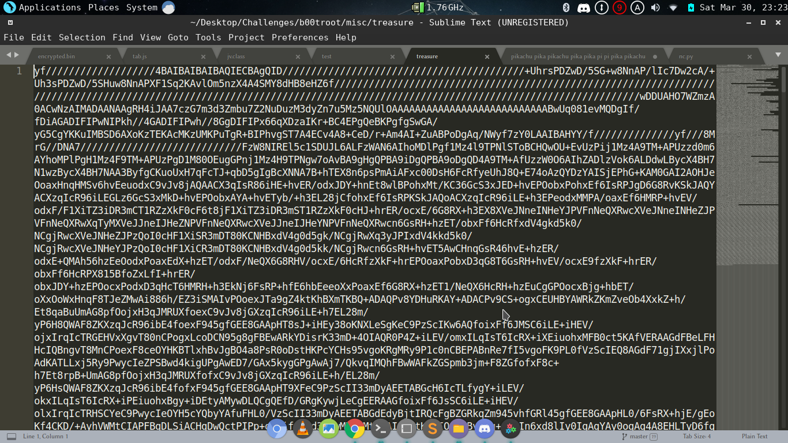
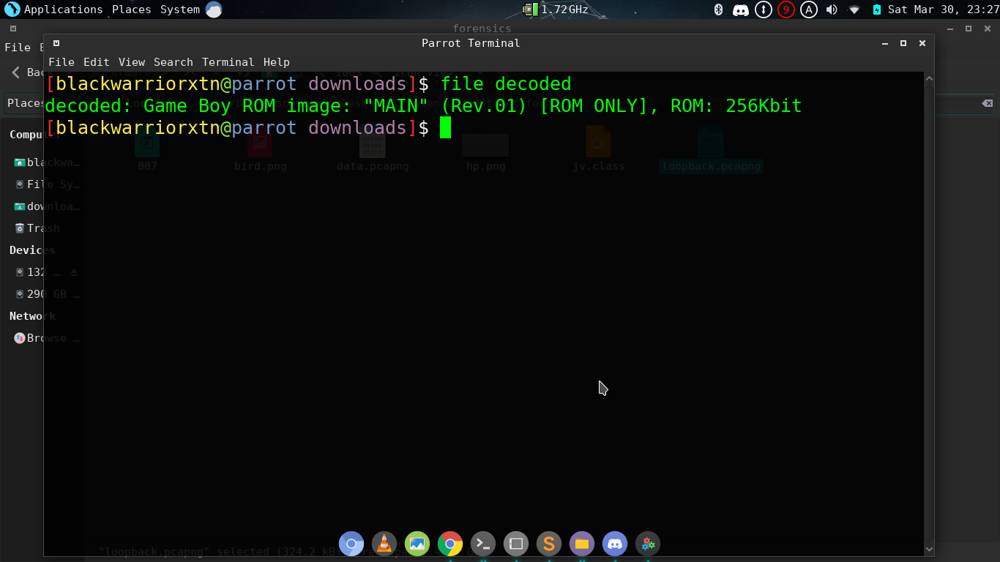
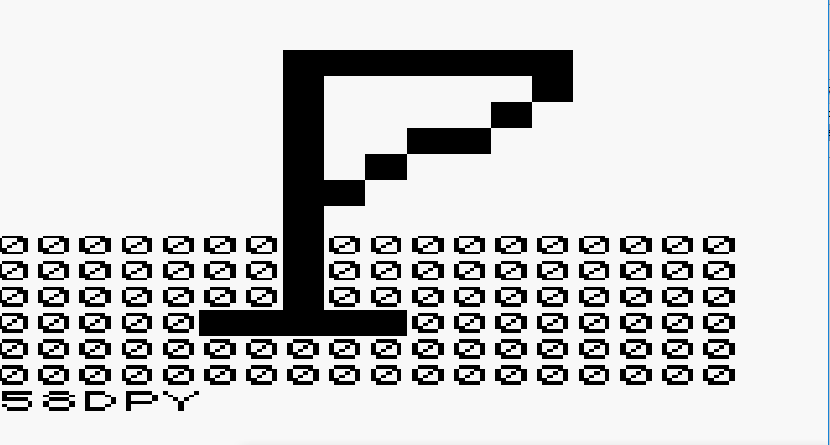

# What is this ??

after taking a deep look at this , i saw the "=" at the end which confirmed my suspicuos that this is just a base64 file
so lets decode the file using this website https://www.freeformatter.com/base64-encoder.html
we get another file lets see what is it

oh so its a gameboy rom i download gameboy emulator and run that rom 
we get this

and thats the passcode there lets wrap it in the flag format and we are good to go
## flag
b00t2root{58DPY}
