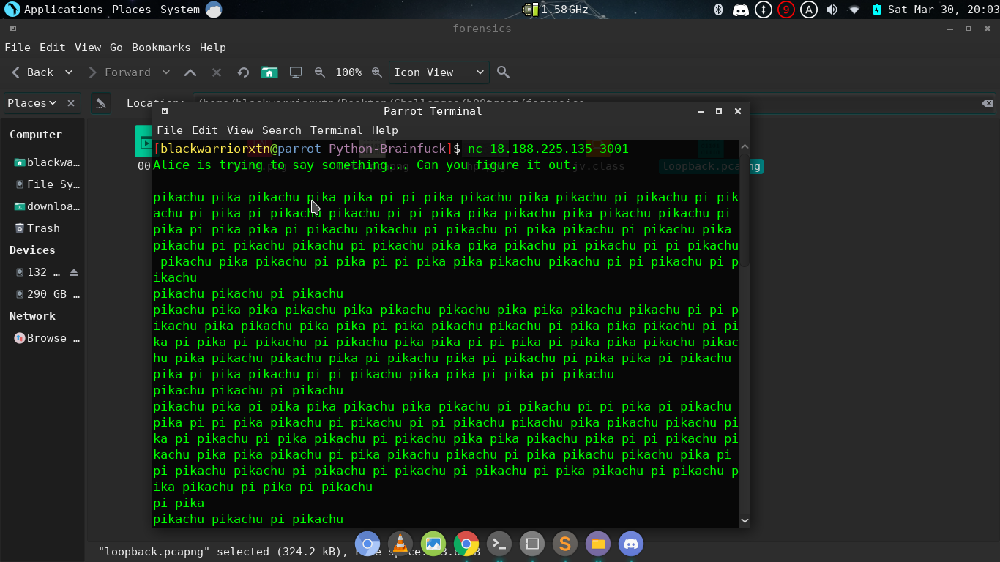
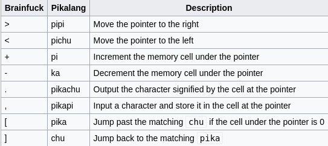
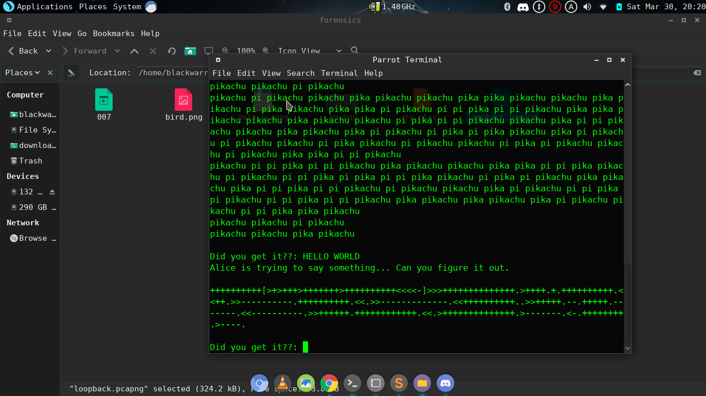
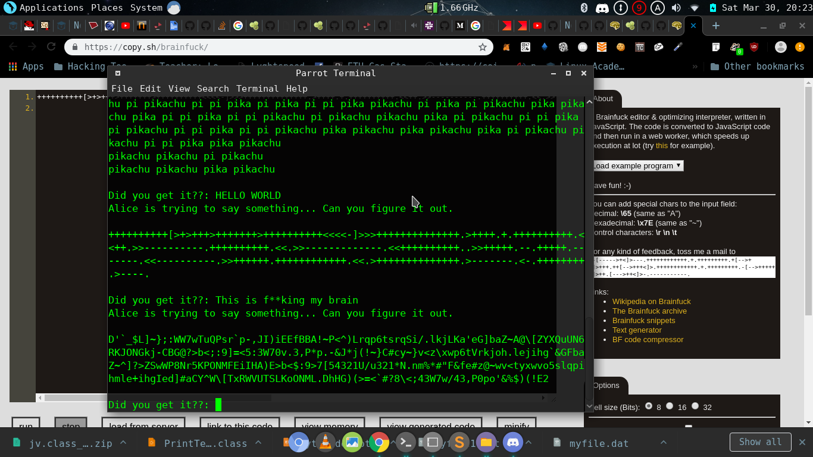

# First Thoughts

so after connecting we get that pika messages .

the first thing will popup in our minds is pokemon anime

## Walkthrough

 but there is Pikalang wich is a joke esotric programming language and its identical to brainfuck , except that the instructions are changed into the sounds made by Pikachu From Pokémon ,as you can see the table below each word have its instructions 
 
 
 we can use an interpreter to see what this means ,i found this one that is written in python and it works find thanks to 
 jokesmithjohnson 
 https://github.com/joelsmithjohnson/pikachu-interpreter
 
 so that means " HELLO WORLD "
 
 we go back to nc and write HELLO WORLD , we get another one that we saw in the  table 
 
 which is very abvious its another estoric language called brainfu** which is related to pikalang 
 and for that we can use this online interpreter https://copy.sh/brainfuck/
 after running we get "This is f**/king my brain" so lets go and write that "
 
 
 oh we get another that one is called Malbolge its another esoteric language and i checked every estoric language that have that weird ecriture to find it 
 and i used this online interpreter to execute and get the flag 
 http://malbolge.doleczek.pl/
## flag : b00t2root{e50t3ric_langu4g35_ar3_1n5an3}
## estoric languages are really amazing 
